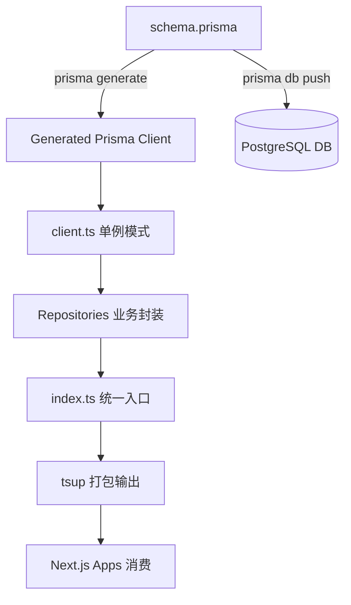

# Prisma 与 DB 初始化流程详解

本文档详细描述了 AgentHub 项目中 `@agenthub/db` 包的初始化流程、构建机制以及在全栈开发中的运作方式。

## 1. 架构概览

数据库层采用 **Prisma ORM** + **PostgreSQL**。整个流程可以分为四个阶段：**定义 (Define)**、**同步 (Sync)**、**实例化 (Instantiate)** 和 **导出 (Export)**。

---

## 2. 详细初始化步骤

### 第一步：模型定义 (Define)
一切始于 [schema.prisma](file:///d:/code/github/AgentHub/packages/db/prisma/schema.prisma)。
- 开发者在该文件中定义数据模型（Model）、枚举（Enum）和表间关系。
- 它是数据库结构的唯一事实来源。

### 第二步：代码生成 (Generate)
运行 `pnpm db:generate` 命令：
- Prisma CLI 读取 `schema.prisma`。
- 在 `node_modules/.prisma/client` 中生成强类型的 Prisma Client。
- 这一步为整个项目提供了 TypeScript 类型提示。

### 第三步：数据库同步 (Sync/Migrate)
运行 `pnpm db:push` 或 `prisma migrate dev`：
- 将 Schema 的变更同步到物理数据库（PostgreSQL）。
- 确保数据库表结构与代码定义保持一致。

### 第四步：单例实例化 (Instantiate)
在 [client.ts](file:///d:/code/github/AgentHub/packages/db/src/client.ts) 中完成：
- **单例模式**：使用 `globalThis` 缓存实例，防止 Next.js 热重载导致数据库连接溢出。
- **环境感知**：开发环境下开启详细 SQL 日志，生产环境下仅保留错误日志。

### 第五步：业务逻辑封装 (Repositories)
在 [repositories/](file:///d:/code/github/AgentHub/packages/db/src/repositories) 目录下：
- 将底层的 Prisma 调用封装为具体的业务方法（如 `createAgent`, `listMessages`）。
- 这种封装使得上层应用（如 Web 端）无需关心底层的查询细节。

### 第六步：统一导出与打包 (Export & Build)
- **导出**：[index.ts](file:///d:/code/github/AgentHub/packages/db/src/index.ts) 统一导出 `prisma` 实例和所有 `repositories`。
- **打包**：使用 `tsup` 将代码打包成 ESM 和 CJS 格式，供 Monorepo 中的其他包消费。

---

## 3. 开发常用命令清单

| 命令 | 作用 |
|------|------|
| `pnpm db:generate` | 生成 Prisma Client 类型文件 |
| `pnpm db:push` | 将 Schema 变更强制推送到数据库（不生成迁移文件，适合开发阶段） |
| `pnpm db:seed` | 运行 [seed.ts](file:///d:/code/github/AgentHub/packages/db/src/seed.ts) 填充初始测试数据 |
| `pnpm db:studio` | 启动可视化管理界面，直接查看和编辑数据 |

## 4. 总结流程图

通过这套流程，AgentHub 实现了**数据库结构即代码**、**全链路类型安全**以及**高性能的连接管理**。
